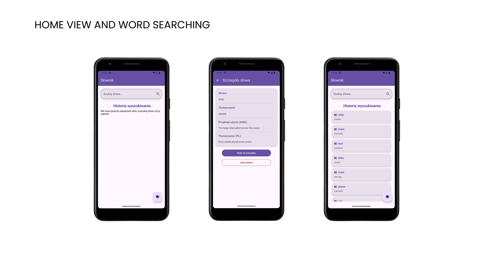
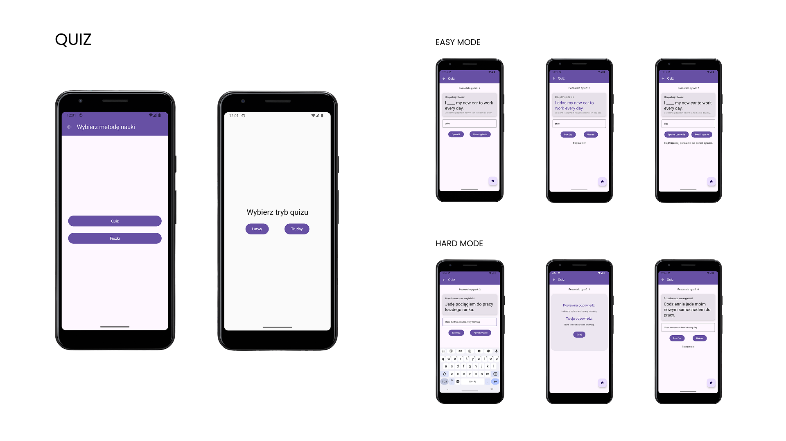
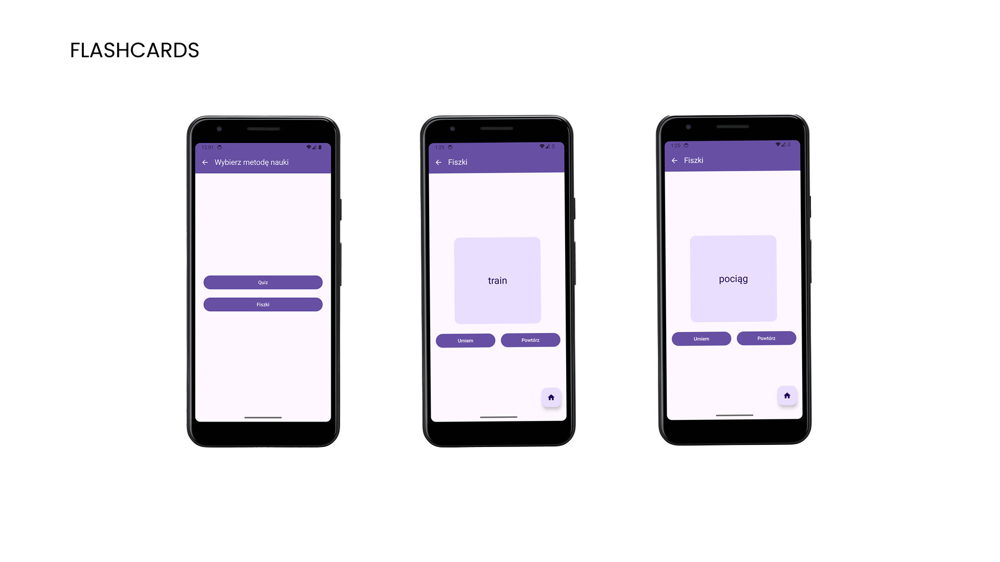
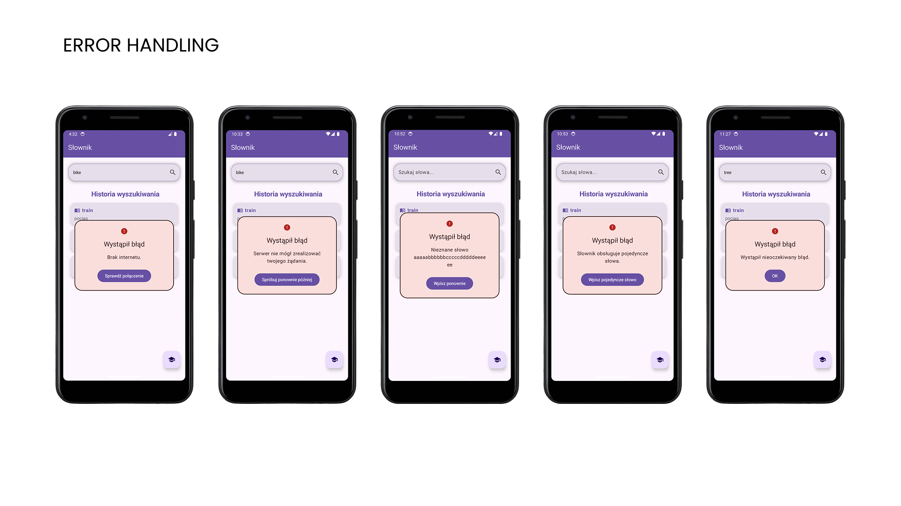
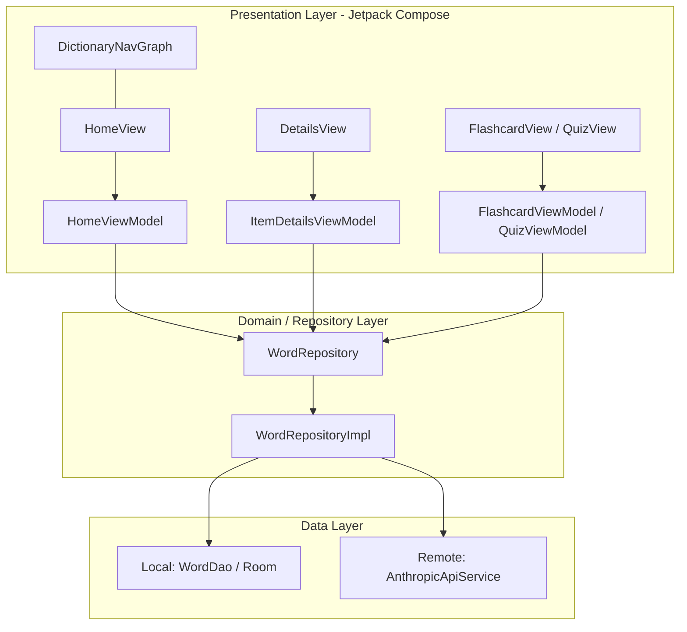

# AI-Powered Vocabulary Learning Application (Bachelor's Thesis)

A modern, native Android application designed to facilitate personalized language learning through generative AI and efficient data management. Unlike traditional language apps with rigid learning paths, this project provides users with a flexible tool to learn vocabulary tailored to their specific needs.

## 🎬 Visual Overview

## 🌟 Key Features

*   **Intelligent Word Search:** Seamlessly translates words by querying a local database (search history) first, falling back to a cloud-based API if the word is new.
*   **AI Context Generation:** Leverages the **Claude 3.5 Haiku** model to generate real-time usage examples and translations, helping users understand word context.
*   **Offline Accessibility:** All searched words and AI-generated examples are stored in a local **Room** database, enabling full functionality without an internet connection.
*   **Interactive Learning Modules:** Includes active recall tools such as **Flashcards** and a **Quiz** module with multiple difficulty levels to improve long-term retention.
*   **Robust Error Handling:** Comprehensive management of network failures and API issues via reactive UI feedback.

## 🛠 Tech Stack

*   **Language:** Kotlin
*   **UI Framework:** Jetpack Compose (Declarative UI)
*   **Architecture:** MVVM (Model-View-ViewModel)
*   **Asynchronous Processing:** Kotlin Coroutines & Flow
*   **Database:** Room (SQLite abstraction)
*   **Networking:** Retrofit & OkHttp
*   **AI Provider:** Anthropic Claude 3.5 Haiku API

## 🏗 Architecture & Design

The application implements a clean **MVVM** pattern to ensure modularity and scalability. Below is the architectural flow based on the project's internal package structure:

### Additional Resources
*   🖼️ **[Functional Overview (PDF)](docs/bachelors-thesis-presentation.pdf)** - A step-by-step visual guide and screenshots of the application's key modules.
